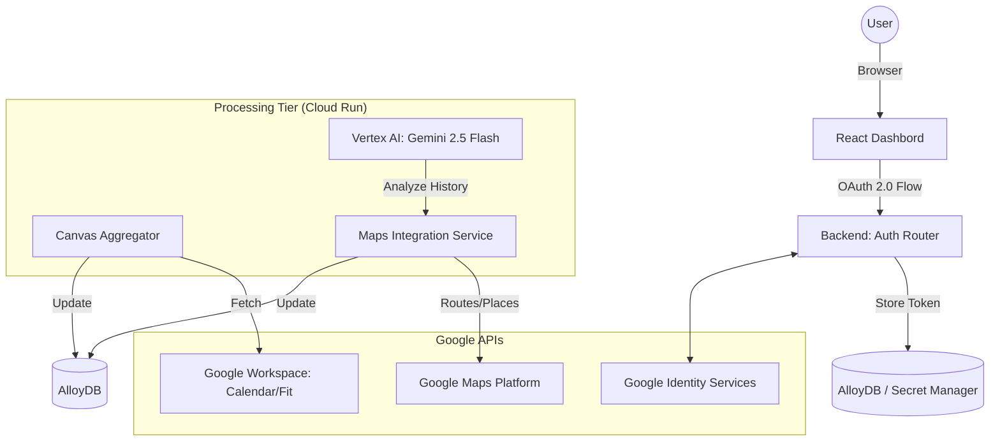

# OrcheFlowAI — Google Integration & Maps Track Architecture

This document outlines the architectural blueprint for integrating Google Workspace (Auth, Calendar, Fit) and Google Maps Platform into the OrcheFlowAI cockpit.

## 1. High-Level Architecture (Data Flow)

## 2. Component Design

### A. Identity & Auth (Security First)
- **Protocol**: OAuth 2.0 Authorization Code Flow with PKCE.
- **Scopes**:
    - `openid`, `email`, `profile`
    - `https://www.googleapis.com/auth/calendar.readonly` (Life Canvas events)
    - `https://www.googleapis.com/auth/fitness.activity.read` (Health Snapshot)
    - `https://www.googleapis.com/auth/maps-platform.reporting` (Location Insights)
- **Token Security**: Tokens will be stored in a separate `user_credentials` table in AlloyDB, encrypted at rest using **GCP Cloud KMS**.

### B. Maps Track (The "Spatial" Life Canvas)
- **Historical Insights**: Uses **Maps Places API** and **Fit Location Data** to visualize:
    - "Locations Visited" (Heatmap/List).
    - "Favorite Spots" (Top visited clusters).
- **Commute Tracker**: Integrated into the Daily Timeline.
    - Uses **Maps Routes API** to calculate real-time travel between calendar events.
- **AI Recommendations**:
    - Gemini 2.5 Flash correlates user focus mode (e.g., RECOVERY) with nearby "quiet spots" or upcoming travel slots to suggest tour destinations.

### C. Secret Management, IAM & Proxy Networking
- **Secret Manager**: `GOOGLE_CLIENT_ID`, `GOOGLE_CLIENT_SECRET`, and `GOOGLE_MAPS_API_KEY` are fetched from Secret Manager at runtime.
- **IAM Roles**:
    - `roles/secretmanager.secretAccessor` (Applied to Cloud Run Service Account).
    - `roles/aiplatform.user` (For Vertex AI access).

### 4. Regional Affinity & Networking
*   **Region:** `asia-southeast1` (Singapore) used for all components to minimize latency and satisfy AlloyDB VPC requirements.
*   **VPC Connector:** `orcheflow-vpc-conn` enables private IP communication between Cloud Run and AlloyDB.
*   **Firewall:** Explicit ingress rules (`allow-internal-orcheflow`) permit port 5432 traffic from the VPC Connector range.
*   **TLS termination:** Handled by Cloud Run Load Balancer; backend code dynamically upgrades callback URIs to `https`.

### 5. Production Hardening (Secret Management)
*   **Stripped Credentials:** Backend automatically strips whitespace/newlines from Secret Manager values to prevent `invalid_client` OAuth errors.
*   **Dynamic Callback:** OAuth redirect URIs are dynamically generated based on the request host to avoid environment mismatch.
*   **Auto-Fallback Profile:** In case of catastrophic regional failure, the system automatically detects connectivity issues and falls back to a localized SQLite instance for high-availability hackathon demo stability.

## 3. Security Quality Gates
| Feature | Security Measure |
| :--- | :--- |
| **API Keys** | Restricted to specific IP/Referrer in Google Cloud Console. |
| **User Data** | Row-Level Security (RLS) in AlloyDB ensures User A cannot see User B's Maps history. |
| **Tokens** | Short-lived Access Tokens; Refresh Tokens stored with encryption. |

---
> [!IMPORTANT]
> To proceed, we need to register the application in the Google Cloud Console and generate OAuth Credentials.
